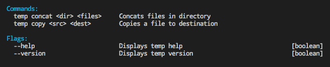

<p align="left">
  <a href="http://github.com/blujedis/kawkah"></a>
</p>

An extensible command line parsing utility with middleware. Although fairly stable this module is not in production use as of 8/2018.

Key benefits of Kawkah are that it allows you to extend the validation pipeline and parsing via middleware. This allows you to easily create hooks for tracking usage or to add some sort of custom validation step.

Another key feature is the ability to build help groups for display. Kawkah is very customizable on this front. You can mix and match just about anything from examples to options to commands under a single heading with ease.

This is done by using namespaces. you might do something like:

```ts
kk.group('MyGroup', 'commandName.option', 'examples.name', 'Some static string of text');
```

We'll provide more on this soon...



## Install

```sh
$ npm install kawkah
```

## Usage

Here are the basics. After instantiating define your args, flags and other settings then call <code>.listen()</code> to have Kawkah listen for process.argv arguments.

```ts
import { Kawkah } from 'kawkah';

// OR

const Kawkah = require('kawkah').Kawkah;
const kk = new Kawkah({ /* options */ });

kk
  .arg('order', {
    coerce: v => v.toUpperCase()
  })
  .flag('toppings', {
    type: 'array',
    validate: /(cheese|mushroom|ham)/
  })
  .flag('deep-dish')
  .listen('order --toppings cheese --toppings ham --deep-dish');

// RESULT

const result = {
  {
    _: [ 'ORDER' ],
    __: [],
    toppings: [ 'cheese', 'ham' ],
    deepDish: true,
    '$0': 'app',
    '$command': null
  }
}
```

## Table of Contents

The documentation listed in this table of contents is here for convenience. If you find an error we suggest heading over to the [Generated Docs](https://blujedis.github.io/kawkah/). These tend to be pretty accurate given the cannot be generated without the project building. We try to keep examples up to date but there's only so much time. Feel free to create a PR if you see a mistake!

* [API](/assets/API.md)
* [Options](/assets/OPTIONS.md)
* [Defining Middleware](/assets/MIDDLEWARE.md)
* [Examples](/assets/EXAMPLES.md)
* [Kawkah Parser](https://github.com/blujedis/kawkah-parser)

## Docs

Documentation generated from source.

See [https://blujedis.github.io/kawkah/](https://blujedis.github.io/kawkah/)

## Change

See [CHANGE.md](CHANGE.md)

## License

See [LICENSE.md](LICENSE)